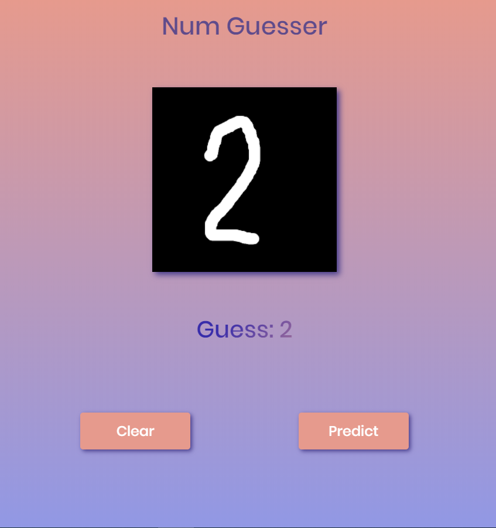

# numguesser

## A handwritten digit recognition app. 

The neural network was built in python, it is in the python-code folder.

The webpage and its components are in the CNN folder.

The model and the neural network weights are in the main directory.

